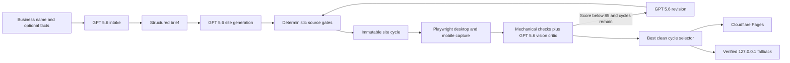
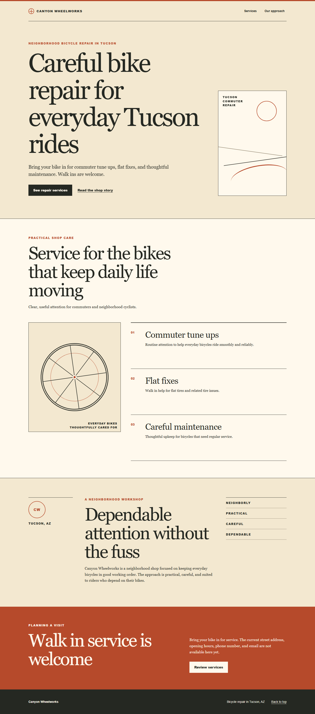

<p align="center">
  
</p>

<p align="center"><strong>One business name in. A designed, critiqued, deployed website out.</strong></p>

Mainstreet is an AI website generator for local small businesses. Give it a business name and optional facts. It creates a structured brief, generates a complete static site, reviews desktop and mobile screenshots with a vision critic, revises the design up to three times, selects the strongest clean cycle, and publishes it.

[View the live prototype](https://mainstreet-hackathon.pages.dev/)

## Why Mainstreet

Small businesses often need a credible web presence before they have the time, budget, copy, photography, or design vocabulary to commission one. Mainstreet turns the first blank page into a usable prototype while keeping uncertain facts out of public copy.

The critic loop is the core idea. Generation is not treated as the finish line. Every run saves its source, desktop and mobile screenshots, mechanical checks, vision critique, score, and revision handoff. The final selector promotes the highest scoring cycle that passes deterministic checks.

## What it does

- Runs from business name to reachable URL with one command.
- Uses GPT 5.6 with strict structured outputs for intake, generation, critique, and revision.
- Captures the site at 1440 by 900 and 390 by 844 with Playwright.
- Scores layout, hierarchy, typography, color, mobile behavior, usability, originality, and trust.
- Preserves every cycle as immutable judging evidence.
- Rejects remote dependencies, scripts, unsafe markup, placeholder contact facts, emojis, and user facing dash characters in generated sites.
- Deploys through Cloudflare Pages, with a verified loopback server fallback when Cloudflare credentials are absent.

## Quick start

Requirements:

- Node.js 22 or newer
- npm
- An OpenAI API key
- Optional Cloudflare Pages credentials

```powershell
git clone https://github.com/natbirchmail-ctrl/mainstreet.git
cd mainstreet
npm ci
npx playwright install chromium
Copy-Item .env.example .env
```

Add `OPENAI_API_KEY` to `.env`. Add `CLOUDFLARE_API_TOKEN` and `CLOUDFLARE_ACCOUNT_ID` if you want a public Pages URL. Mainstreet never prints these values or writes them into run artifacts.

Link the local CLI once:

```powershell
npm link
```

Then run the full pipeline:

```powershell
mainstreet run "Harborlight Flower Studio" --fast
```

The command needs no further input. With Cloudflare credentials, it ends on a verified Pages URL. Without them, it starts the finished site on `http://127.0.0.1:4601/` and prints that URL only after the server binds.

You can supply confirmed facts without starting an interview:

```powershell
mainstreet run "Canyon Wheelworks" --city "Tucson, AZ" --details "Neighborhood bicycle repair for commuters. Walk in service is welcome." --fast
```

If you do not want to link the CLI, use the equivalent repository command:

```powershell
npm run mainstreet -- run "Harborlight Flower Studio" --fast
```

## Commands

| Command | Purpose |
| --- | --- |
| `mainstreet run "Name" --fast` | Run intake, build, critique, revision, selection, and delivery |
| `mainstreet intake "Name"` | Create a structured business brief |
| `mainstreet build <slug>` | Build the first immutable site cycle |
| `mainstreet critique <slug>` | Capture and score the latest cycle |
| `mainstreet revise <slug>` | Create the next cycle from critic findings |
| `mainstreet deploy <slug>` | Promote the selected cycle to Cloudflare Pages or local serving |
| `mainstreet serve <slug>` | Serve a generated site on `127.0.0.1:4601` |

## Pipeline



Each model stage uses a versioned prompt and a strict JSON schema. The OpenAI SDK's automatic retries are disabled so Mainstreet owns one bounded three attempt retry ladder. If a critic or revision remains unavailable, the pipeline selects and delivers the best completed build instead of discarding the run.

## Example run results

These scores come from the committed critic artifacts. They are design review signals, not an objective benchmark.

| Business | Score path | Selected cycle | Final verdict | Mechanical result | Evidence |
| --- | --- | ---: | --- | --- | --- |
| Canyon Wheelworks | 78 to 82 to 82 | 3 | Revise | Passed every cycle | [Run report](runs/canyon-wheelworks/RUN-REPORT.md) |
| Harborlight Flower Studio | 72 to 77 to 79 | 3 | Revise | Passed every cycle | [Run report](runs/harborlight-flower-studio/RUN-REPORT.md) |
| Juniper Oven | 60 to 78 to 79 | 3 | Revise | Cycle 1 failed; cycles 2 and 3 passed | [Run report](runs/juniper-oven/RUN-REPORT.md) |

All three selected scores improved over the initial pass, but none reached the 85 point ship threshold. The critic withheld approval because confirmed operating details were absent and some mobile typography remained small. Mainstreet publishes the best available concept without pretending that incomplete business facts are launch ready.

### Canyon Wheelworks: first pass

<p align="center">
  
</p>

### Canyon Wheelworks: selected pass

<p align="center">
  
</p>

The selected site scored 82, four points above the first pass. All three cycles, mobile captures, source files, mechanical reports, and full critiques remain under `runs/canyon-wheelworks/`.

## Run artifacts

```text
runs/<slug>/
  brief.json
  cycle-01/
    site/index.html
    site/styles.css
    screenshots/desktop-home.png
    screenshots/mobile-home.png
    mechanical.json
    critique.json
    revise.json
  cycle-02/
  cycle-03/
  deployment.json
  run-report.json
  RUN-REPORT.md
```

Evidence files are append only. Starting the same business again moves the previous run intact into the ignored `.trash/` recovery area. Later promotions add versioned deployment records instead of overwriting history.

## Testing

Run the complete local suite:

```powershell
npm test
```

Run syntax checks and tests together:

```powershell
npm run check
```

The suite covers CLI parsing, strict OpenAI request contracts, retry behavior, intake fact handling, generated source gates, immutable cycles, screenshot capture, critic fallback, revision limits, path traversal defense, loopback serving, Cloudflare deployment, truthful local fallback, and append only promotion history.

## Security and privacy

- Secrets live only in the ignored `.env` file.
- Generated sites are static HTML and CSS. Scripts, forms, remote resources, inline event handlers, and unsafe URLs are rejected.
- Fast mode never invents phone numbers, email addresses, street addresses, or business hours.
- The local server binds only to `127.0.0.1` and restricts serving to the selected site directory.
- Cloudflare failures degrade to a local URL without exposing command output or credentials.
- Run artifacts contain prompts, model results, screenshots, and public business input. Review owner supplied details before committing a real business run.

See [SECURITY.md](SECURITY.md) for the threat boundary and disclosure process.

## Built with Codex

Codex built Mainstreet from inception to deployed prototype during OpenAI Build Week. The root Codex session was the sole code and documentation author. It read the approved build plan, created the repository, wrote the implementation and tests, ran the real GPT 5.6 and Playwright pipeline, diagnosed deployment failures, and produced the three evidence runs.

Parallel Codex subagents performed read only API research, reference analysis, visual review, dependency inspection, and adversarial release audits. They did not edit repository files or author code. Their findings were returned to the root session, which made and tested every change. The commit history records the build in small milestones from scaffold through the first generated site, critic loop, delivery, hardening, examples, and public release.

GPT 5.6 also powers Mainstreet at runtime. It creates the brief, writes the site, reviews rendered desktop and mobile images, and applies targeted revisions. Deterministic code remains responsible for schemas, source safety, screenshot capture, mechanical gates, cycle limits, selection, storage, and delivery.

## Devpost description

Mainstreet gives a local business a designed web presence from one command. A business name enters a four stage GPT 5.6 pipeline: structured intake, semantic HTML and CSS generation, screenshot based design criticism, and targeted revision. Playwright captures desktop and mobile views after every cycle. A strict vision rubric scores hierarchy, typography, color, responsiveness, usability, originality, and trust, while deterministic checks catch overflow, console errors, remote requests, unsafe markup, and missing semantics. Mainstreet keeps every source snapshot, screenshot, critique, and score, then deploys the strongest clean cycle to Cloudflare Pages. If deployment credentials are unavailable, it serves the same result on a verified loopback URL. Fast mode completes with no human input after the command and never invents precise contact facts. Three committed runs show the critic loop raising scores across different business categories and visual directions.

## Limits

- Fast mode produces a static design concept from incomplete input, not a production approved customer site, commerce system, or content management system.
- A name only run cannot supply confirmed address, hours, pricing, or contact details. Mainstreet leaves those facts unpublished.
- Critic scores are model judgments. The committed screenshots and findings make those judgments inspectable.
- A real business launch still requires verified operating facts, owner approval, and a final human review.
- The shared Pages alias shows the most recently promoted example. Each deployment artifact also records its immutable preview URL.

## License

The software and documentation are available under the [MIT License](LICENSE). Mainstreet brand marks follow the separate [asset notice](assets/brand/ASSET-NOTICE.md).
