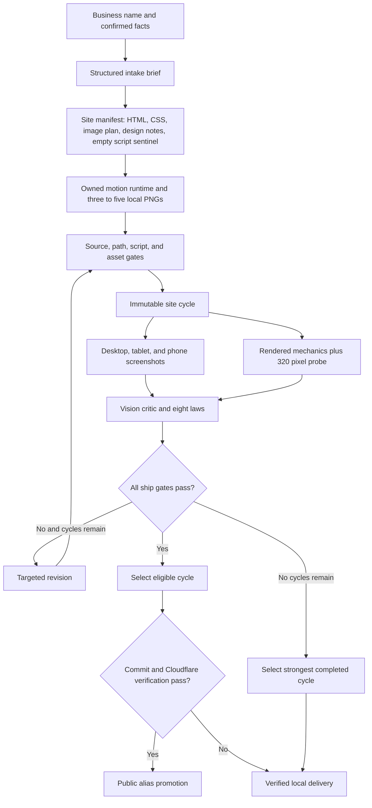

<p align="center">
  
</p>

<p align="center"><strong>One business name in. A designed and critiqued website out. Public promotion happens only after every ship gate passes.</strong></p>

Mainstreet is an AI website generator for local small businesses. Give it a business name and optional facts. It creates a structured brief, builds an image led static site, captures rendered evidence, applies an independent vision critique, revises up to three cycles, and selects the strongest safe result. A selected result can be served locally. Only a ship eligible result can replace the public Cloudflare Pages alias.

## Public release status

Canyon Wheelworks owns the current shared alias. Cloudflare verified the selected site and every deployed file against the committed deployment manifest.

- `LIVE_ALIAS_OWNER_SLUG: canyon-wheelworks`
- `LIVE_URL: https://mainstreet-hackathon.pages.dev/`
- `LIVE_IMMUTABLE_URL: https://f3a57ad6.mainstreet-hackathon.pages.dev/`
- `LIVE_AGGREGATE_SHA256: e9af70db174e2ac1a3be49fb6519513c5098f61ad377e6900bb5e1e56c9140e9`
- `DEPLOYMENT_COMMIT: 5e61d6a09eefaad61973a3c70a81b8b96ccba5a4`

The shared alias points to the most recent verified promotion. Each example also has an immutable Cloudflare URL in the evidence table below. A loopback URL proves local delivery only and never replaces either public record.

## Why Mainstreet

Small businesses often need a credible web presence before they have the time, budget, copy, photography, or design vocabulary to commission one. Mainstreet turns the blank page into an inspectable prototype while keeping uncertain facts out of public copy.

The critic loop is the core idea. Generation is not the finish line. Every cycle preserves the source, local image evidence, canonical desktop, tablet, and phone screenshots, and a digest-bound full-page critic screenshot for each viewport. It also records normal, reduced motion, JavaScript disabled, and 320 pixel mechanical evidence, law findings, the score, and the revision handoff. Mainstreet derives ship eligibility from those artifacts instead of accepting a model's recommendation.

## What it does

- Runs intake, build, critique, revision, selection, and delivery from one command.
- Uses strict structured outputs for the brief, site manifest, vision critique, and revision.
- Requires the model to return semantic HTML, CSS, an empty script sentinel, a plan for three to five local PNG images, and design notes.
- Materializes an owned deterministic `script.js` and its matching motion styles. Model supplied JavaScript is rejected.
- Captures desktop at 1440 by 900, tablet at 1024 by 768, and phone at 390 by 844.
- Captures a digest-bound full-page critic image for each canonical viewport.
- Probes a 320 by 800 viewport mechanically without treating it as a fourth critic screenshot.
- Preserves every cycle as immutable judging evidence.
- Blocks public promotion when any ship gate fails, when the critic uses source fallback, or when deployment verification fails.

## Quick start

Requirements:

- Node.js 22 or newer
- npm
- An OpenAI API key
- Optional Cloudflare Pages credentials

```powershell
git clone https://github.com/natbirchmail-ctrl/mainstreet.git
cd mainstreet
npm ci
npx playwright install chromium
Copy-Item .env.example .env
```

Add `OPENAI_API_KEY` to `.env`. Add `CLOUDFLARE_API_TOKEN` and `CLOUDFLARE_ACCOUNT_ID` if you want an eligible run to attempt public promotion. Mainstreet never prints these values or writes them into run artifacts.

Link the local CLI once:

```powershell
npm link
```

Then run the full pipeline:

```powershell
mainstreet run "Harborlight Flower Studio" --fast
```

The command needs no further input. A run that clears every ship gate and completes verified Cloudflare delivery may end on a public Pages URL. Any failed gate, missing public prerequisite, or Cloudflare failure keeps delivery on the verified loopback preview at `http://127.0.0.1:4601/`.

You can supply confirmed facts without starting an interview:

```powershell
mainstreet run "Canyon Wheelworks" --city "Tucson, AZ" --details "Neighborhood bicycle repair for commuters. Walk in service is welcome." --fast
```

If you do not want to link the CLI, use the repository command:

```powershell
npm run mainstreet -- run "Harborlight Flower Studio" --fast
```

## Commands

| Command | Purpose |
| --- | --- |
| `mainstreet run "Name" --fast` | Run intake, build, critique, revision, selection, and delivery |
| `mainstreet intake "Name"` | Create a structured business brief |
| `mainstreet build <slug>` | Build the first immutable site cycle |
| `mainstreet critique <slug>` | Capture and score the latest cycle |
| `mainstreet revise <slug>` | Create the next cycle from critic findings |
| `mainstreet deploy <slug>` | Promote an eligible selected cycle or record local delivery |
| `mainstreet serve <slug>` | Serve a generated site on `127.0.0.1:4601` |

## The quality system

### Design contract

The builder commits to one visual idea and carries it through type, color, spacing, imagery, and interaction. Mainstreet expresses the design contract as fresh clean-room prompt language and checks the same rules in the vision critic.

- **Copy:** headings identify the subject or promise, body copy explains it, and buttons direct. None of them decorate. Primary editorial headings use at most two meaningful words unless the exact business name stands alone. Unknown operating facts remain unpublished.
- **Composition:** every section opens as a complete thought. Its first meaningful beat appears in the upper two thirds when the section aligns to the viewport. Centered heading blocks stay centered as one unit. Repeating layouts fit their actual item count without empty slots or orphan cards.
- **Motion:** each site chooses one or two calm moves from the named vocabulary: `pinned chapter parallax`, `click reel row`, `story stepper`, `staged hero arrival`, and `gentle one-way scroll reveals`. It never uses all five at once. No content depends on animation to become visible or reachable. JavaScript-disabled and reduced-motion modes preserve the complete page.
- **Imagery:** each site plans three to five PNGs as one contemporary commissioned shoot. Every image has a distinct job, precise prompt, alt text, and deliberate focal crop. No image pretends to document a history that was never supplied. Mainstreet records whether each file came from image generation, verified carry forward, or deterministic fallback.

### Eight hard laws

| Law | Required result |
| --- | --- |
| Headline discipline | Headings identify, body explains, and actions direct without decorative copy |
| Fold composition | Each section opens as a complete composition |
| Complete layouts | Repeating content has no empty slot, phantom column, orphan card, or broken count state |
| First beat visibility | Every section reveals its first meaningful content promptly without depending on animation |
| Image contrast | Text remains readable beside or over imagery across difficult crops |
| Motion restraint | One or two moves support hierarchy without delaying or competing with reading |
| Imagery coherence | The images read as one shoot with deliberate focal crops and no fabricated history |
| Factual restraint | Copy contains no invented fact, review, rating, award, history, or claim |

Fold composition, first beat visibility, image contrast, and imagery coherence require evidence from desktop, tablet, and phone. Missing viewport evidence makes the law unverified. Source fallback makes the visual laws unverified.

### Exact ship gates

A cycle is ship eligible only when all of these statements are true:

1. The derived visual score is at least 85.
2. The critique contains no major issue.
3. The rendered mechanical report passes.
4. All three to five image assets are resolved without deterministic fallback.
5. The critic ran in `vision` mode against desktop, tablet, and phone screenshots.
6. All eight quality laws pass.

The selector prefers ship eligible cycles. If none qualify, it prefers mechanically safe scored cycles, then other scored cycles, with the later cycle winning a tie. Selection preserves the strongest completed result; it does not grant public eligibility.

Public promotion adds two operational requirements: the run must resolve to a Git commit, and Cloudflare must return and verify the complete selected site. A failed gate, missing commit, unavailable credential, or Cloudflare error records local delivery. That local result cannot replace the public alias.

## Pipeline



Each model stage uses a versioned prompt and strict JSON schema. Mainstreet owns one bounded three attempt retry ladder. If rendered capture fails, source review can guide another revision, but it can never pass the vision mode gate. If the critic or revision remains unavailable, Mainstreet preserves the best completed build and keeps delivery local unless an independently completed cycle already satisfies every public gate.

## Run artifacts

```text
runs/<slug>/
  brief.json
  cycle-01/
    build.json
    assets.json
    site/
      index.html
      styles.css
      script.js
      assets/
        <three-to-five-owned-images>.png
    screenshots/
      desktop-home.png
      tablet-home.png
      mobile-home.png
      manifest.json
      critic/
        desktop-full-page.png
        tablet-full-page.png
        mobile-full-page.png
        manifest.json
    visible-text.txt
    mechanical.json
    critique.json
    revise.json
  cycle-02/
  cycle-03/
  deployment.json
  deployments/
    deployment-02.json
  run-report.json
  RUN-REPORT.md
```

`revise.json`, later cycles, and versioned deployment records appear only when the run reaches those stages. Failure artifacts such as `capture-error.json`, `critic-error.json`, or `revision-error.json` preserve bounded failures without changing prior evidence.

## Example evidence

Each selected critique ran in vision mode and passed mechanics, asset resolution, all eight laws, and ship eligibility. Every run stopped when it reached the score threshold. Cloudflare verified all three deployments. Harborlight records commit `e1bb0948fc6c253999d460c6eeb620d12488d6b6`; Juniper records commit `0d524f78162452d6ac6b65d267f2fc5ca1d8e72a`; Canyon records commit `5e61d6a09eefaad61973a3c70a81b8b96ccba5a4`.

| Business | Score path | Selected cycle | Final verdict | Stop reason | Delivery | Immutable URL | Aggregate SHA 256 | Evidence |
| --- | --- | ---: | --- | --- | --- | --- | --- | --- |
| Canyon Wheelworks | `71 to 86` | 2 | ship | `threshold_reached` | Cloudflare verified | [Immutable deployment](https://f3a57ad6.mainstreet-hackathon.pages.dev/) | `e9af70db174e2ac1a3be49fb6519513c5098f61ad377e6900bb5e1e56c9140e9` | [Run report](runs/canyon-wheelworks/RUN-REPORT.md) |
| Harborlight Flower Studio | `75 to 88` | 2 | ship | `threshold_reached` | Cloudflare verified | [Immutable deployment](https://a4eb8385.mainstreet-hackathon.pages.dev/) | `a1241109055834ae36aac9f642b78c774bd6212fa41e96c94ad8b7600e22a4df` | [Run report](runs/harborlight-flower-studio/RUN-REPORT.md) |
| Juniper Oven | `80 to 85` | 2 | ship | `threshold_reached` | Cloudflare verified | [Immutable deployment](https://8107ec4c.mainstreet-hackathon.pages.dev/) | `028250693db26937ae9f84f8a8046278921e3a291d18567ff635ef818738d5c8` | [Run report](runs/juniper-oven/RUN-REPORT.md) |

The shared alias at the top of this document currently serves Canyon Wheelworks. The immutable URLs keep the Harborlight and Juniper deployments addressable after the shared alias moves.

## Testing and release checks

Run the complete local suite:

```powershell
npm test
```

Run syntax checks and tests together:

```powershell
npm run check
```

Validate the public release snapshot:

```powershell
npm run release:check
```

`release:check` fails closed on the example set, immutable artifact structure, image and deployment digests, screenshot evidence, law and ship eligibility consistency, documentation metadata, unsafe paths, secrets, and private source references across the working tree and reachable history. It also checks the score paths, selected cycles, and verdicts documented above against the committed run reports.

## Security and privacy

- Secrets live only in the ignored `.env` file.
- Generated sites contain semantic HTML, CSS, the owned local script, and three to five local PNGs.
- Model supplied JavaScript, forms, remote resources, inline event handlers, linked paths, unplanned files, and unsafe URLs are rejected.
- Fast mode never invents phone numbers, email addresses, street addresses, business hours, reviews, ratings, awards, or operating claims.
- The local server binds only to `127.0.0.1` and restricts serving to the selected site directory.
- Run artifacts contain prompts, model results, screenshots, generated public images, and public business input. Review owner supplied facts before committing a real business run.

See [SECURITY.md](SECURITY.md) for the trust boundary and disclosure process.

## Built with Codex

Codex was the sole code author for Mainstreet during OpenAI Build Week. The human owner supplied the mission, deadline, and product plan. A root Codex agent then ran the build autonomously from scaffold through deployment. It split bounded research, implementation, tests, adversarial review, visual inspection, release tooling, and documentation among Codex subagents, reconciled their work, and made the final integration decisions.

The process left inspectable proof instead of a polished result alone: small timestamped commits, test first changes, immutable cycle artifacts, Playwright screenshots, vision critiques, deployment manifests, and final release checks. Repository commits use the owner's configured Git identity, so they prove build milestones rather than the identity of a particular Codex subagent.

GPT 5.6 powers Mainstreet's text and vision stages at runtime. The configured image model produces the planned PNGs. Deterministic code remains responsible for schemas, source safety, the owned script, asset integrity, rendered evidence, mechanical gates, cycle limits, selection, storage, delivery, and release validation.

## Devpost description

Mainstreet gives a local business an inspectable website concept from one command. A business name enters a structured pipeline for intake, editorial site generation, local image creation, rendered criticism, and targeted revision. Each cycle contains semantic HTML, CSS, an owned deterministic motion script, three to five local PNGs, canonical desktop, tablet, and phone screenshots, three digest-bound full-page critic images, a 320 pixel mechanical probe, and an eight law critique. Mainstreet derives ship eligibility from a score threshold, issue severity, rendered mechanics, asset resolution, vision evidence, and every quality law. It promotes only an eligible, fully verified site to Cloudflare Pages. Failed gates and deployment failures remain available on a loopback preview without replacing the public alias. The three committed examples improve from `75 to 88`, `80 to 85`, and `71 to 86`; each selected cycle ships from verified vision evidence.

## Limits

- Fast mode produces a static design concept from incomplete input, not a production approved customer site, commerce system, or content management system.
- A name only run cannot supply confirmed address, hours, pricing, or contact details. Mainstreet leaves those facts unpublished.
- Critic scores are model judgments. Screenshots, findings, laws, and mechanical evidence make those judgments inspectable.
- Deterministic source or image fallback can preserve a usable local result, but it cannot create a ship eligible cycle.
- A real business launch still requires verified operating facts, owner approval, and final human review.
- The shared Pages alias can represent only the most recently verified public promotion.

## License

The software and documentation are available under the [MIT License](LICENSE). Mainstreet brand marks follow the separate [asset notice](assets/brand/ASSET-NOTICE.md).
